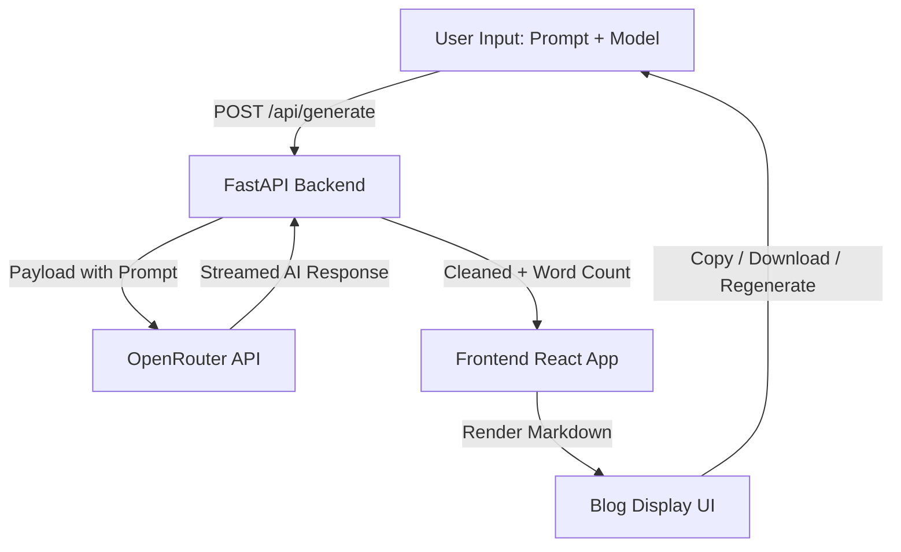
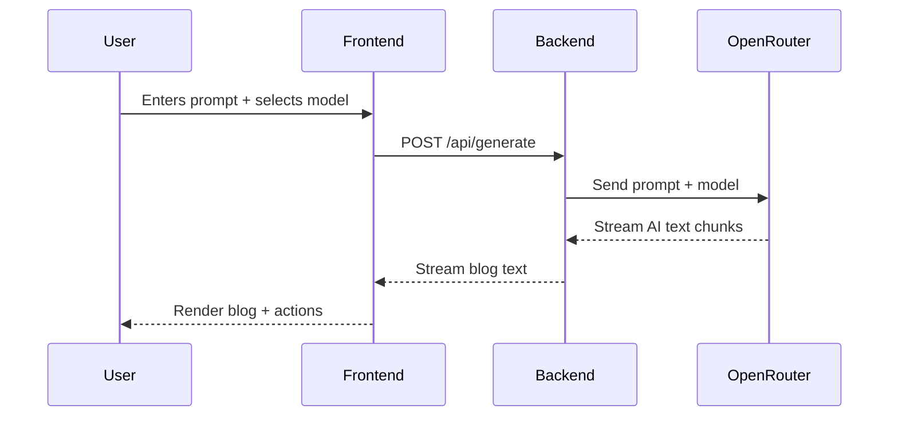

# 📝 AI Blog Generator

Generate professional 1000-word blogs instantly from just a text prompt — powered by free LLMs via **OpenRouter**, with a sleek React frontend and FastAPI backend.

Try the app by clicking here 👉 [AI Blog Generator](https://ai-blog-generator-floccare.netlify.app/)
---

## 🌟 Features

* ⚡ Enter any prompt → get a **1000-word blog** in seconds.
* 🧑‍💻 Choose from multiple **free LLMs** (DeepSeek, OpenAI OSS, MoonshotAI, Qwen, etc.).
* 🎨 **Responsive UI** with light/dark themes and glowing hover effects.
* 📋 Copy and 📥 Download blog content directly.
* 🔄 **Regenerate blog** with one click (same prompt, same model).
* ⏱️ Optimized for **low latency** by selecting faster free models.
* 🧹 Automatic cleanup of AI intros like *“Of course”*.
* 🧮 Built-in **word counter** to ensure \~1000 words.

---

## 🛠️ Tech Stack

### **Frontend**

* ⚛️ React + TypeScript
* 🎨 TailwindCSS + Shadcn UI
* 🌗 Custom Dark/Light Theme Toggle
* 📄 React Markdown for rendering AI blogs beautifully

### **Backend**

* 🐍 FastAPI (Python)
* 🌐 Uvicorn for ASGI
* 🔗 OpenRouter API (free LLMs)
* ⚡ Streaming response for real-time blog generation

### **Deployment**

* 🟣 Backend → Render
* 🟢 Frontend → Netlify

---

## 📐 System Architecture



---

## 🔄 Workflow

1. **User Input** → Selects an AI model + enters blog prompt.
2. **Frontend Request** → Sends prompt + model to FastAPI backend.
3. **Backend Validation** → Ensures only supported free LLMs are used.
4. **API Call to OpenRouter** → Streams generated content.
5. **Content Cleaning** → Removes filler phrases, formats headings, counts words.
6. **Frontend Display** → Blog rendered with professional typography.
7. **User Actions** → Copy, Download, or Regenerate blog.

---

## ⚙️ Challenges & Solutions

### 🐢 Latency

* **Problem**: Some models (like GPT-OSS-120B) were too slow (2–5 mins).
* **Solution**: Researched and selected **fast free models** (DeepSeek V3.1, Moonshot K2, OpenAI GPT-OSS-20B). Added retry + word limit enforcement.

### ❌ Empty Responses

* **Problem**: Certain models (Venice, GLM 4.5 Air) returned empty blogs despite 200 status.
* **Solution**: Added backend validation + empty-content check. Error is streamed to frontend.

### 🎨 UI Styling Conflicts

* **Problem**: Markdown headings initially looked the same.
* **Solution**: Customized typography for `h1`, `h2`, `h3`, lists, and paragraphs → blogs look **professional and structured**.

### 🌐 CORS Errors

* **Problem**: Frontend → Backend API calls blocked.
* **Solution**: Configured CORS in FastAPI with wildcard origin (`*`).

---

## 📊 Example Workflow Diagram



---

## 🧪 Testing

* ✅ Tested backend via **Swagger UI** (`/docs`).
* ✅ Verified frontend API integration.
* ✅ Validated word count ≈ 1000 words.
* ✅ Simulated edge cases (empty prompt, unsupported model).

---

## 🚀 How to Run Locally

### Backend

```bash
cd BACKEND
python -m venv venv
source venv/bin/activate   # or venv\Scripts\activate
pip install -r requirements.txt
uvicorn app.main:app --reload
```

### Frontend

```bash
cd FRONTEND
npm install
npm run dev
```

---

## 🌍 Deployment

* **Backend**: [Render](https://ai-blog-generator-a522.onrender.com)
* **Frontend**: [Netlify](https://your-netlify-link.netlify.app)

---

## 👨‍💻 Author

**Tharun Vankayala**

* 🌐 [Portfolio](https://tharunvankayala.netlify.app)
* 💼 [LinkedIn](https://www.linkedin.com/in/tharun-vankayala/)
* 🐙 [GitHub](https://github.com/tharunkuchulu)
* 📧 [vankayalatharun@gmail.com](mailto:vankayalatharun@gmail.com)

---

✨ *Built by Tharun Vankayala using React, FastAPI, and OpenRouter*

---

